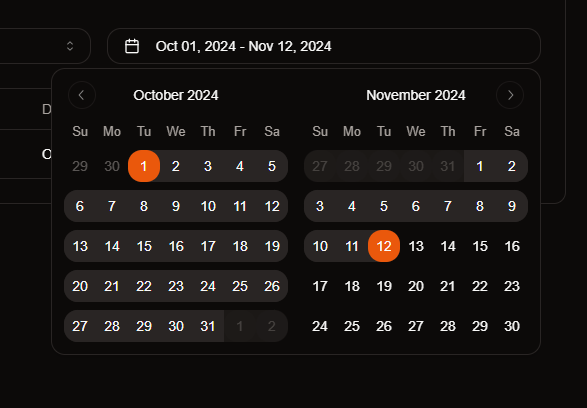
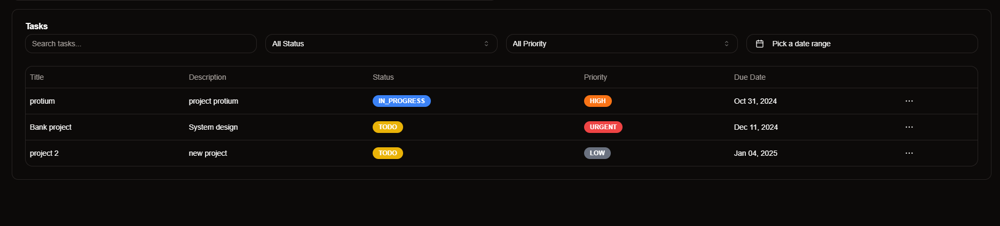

# Assignment submission - Task Management Tool

## deployed link

[deployed Url](https://protium-assignment-task-management-tool.vercel.app)

## Tech Stack

**Client:** Nextjs 15 , React 19, Redux ToolKit, TailwindCSS, ShadCn

**Server:** NestJs, Node, Express, Prisma ORM, postgres 17

## Features

### login using next auth server actions

### Seamless working with dates and filters

### Create, update, assign tasks

### filter, search tasks

### have conversations regarding tasks

### Stats for a quick update

### understand work flow using charts

### Light/dark mode

### easy logout

